<p align="center">
  <br>
</p>

# 📚<small>ᯓ‎𝄞 ˎˊ˗♪♫♪</small> RAGGAE

**R**etrieval-**A**ugmented **G**eneration **G**eneralized **A**rchitecture for **E**nterprise

> A multipurpose local RAG system for processing and analyzing documents (tenders, CVs, reports) with semantic search, hybrid retrieval, and NLI-based compliance scoring.
>
> If you want to install it locally or learn principles, please read/follow these [smoke tests](https://raggae.pages.dev/) first.

[](https://www.python.org/downloads/)
[](LICENSE)
[](https://fastapi.tiangolo.com/)

---

## Table of Contents

- [Overview](#overview)
- [Key Features](#key-features)
- [Architecture](#architecture)
  - [System Architecture](#system-architecture)
  - [Component Diagram](#component-diagram)
  - [Data Flow](#data-flow)
  - [Project Structure](#project-structure)
- [Installation](#installation)
  - [Prerequisites](#prerequisites)
  - [Environment Setup](#environment-setup)
  - [GPU Support (Optional)](#gpu-support-optional)
  - [Dependencies](#dependencies)
- [Usage](#usage)
  - [CLI Tools](#cli-tools)
  - [Web Application](#web-application)
  - [API Endpoints](#api-endpoints)
- [Core Concepts](#core-concepts)
  - [Hybrid Retrieval](#hybrid-retrieval)
  - [NLI-based Compliance Checking](#nli-based-compliance-checking)
  - [Fit Scoring](#fit-scoring)
  - [Document Adapters](#document-adapters)
- [Extension Points](#extension-points)
- [Testing](#testing)
- [Development](#development)
- [Performance Considerations](#performance-considerations)
- [Troubleshooting](#troubleshooting)
- [Contributing](#contributing)
- [License](#license)
- [Authors](#authors)
- [Acknowledgments](#acknowledgments)

---

## Overview

**RAGGAE** is a production-ready, modular Retrieval-Augmented Generation (RAG) system designed to run entirely on local infrastructure. It combines:

- **Dense embeddings** (bi-encoders like E5, GTE, BGE)
- **Sparse retrieval** (BM25 for exact term matching)
- **Hybrid fusion** (linear combination of dense and sparse scores)
- **Cross-encoder re-ranking** (optional, for precision at the top)
- **Natural Language Inference (NLI)** for compliance checking via local LLMs (Ollama)
- **Traceability** with provenance tracking (document, page, block, bounding box)

The system is designed with a **document-agnostic semantic core** and **pluggable adapters** for different document types (PDFs, DOCX, ODT, TXT, MD), making it suitable for:

- **Tender analysis** (requirements extraction, compliance scoring)
- **CV/Resume processing** (skills matching, experience extraction)
- **Technical reports** (semantic search, section extraction)
- **Multi-document batch processing**

---

## Key Features

✨ **Fully Local**: No external APIs required—runs on CPU or GPU (8GB VRAM sufficient)

🔍 **Hybrid Retrieval**: Dense (FAISS) + Sparse (BM25) with configurable fusion

📄 **Multi-Format Support**: PDF, DOCX, ODT, TXT, MD with layout-aware parsing

🎯 **NLI Compliance**: Automatic requirement satisfaction checking via Ollama (Mistral, Llama3)

📊 **Fit Scoring**: Weighted requirement verdicts with exportable audit trails (JSON, CSV)

🌐 **Web UI**: Modern, responsive interface for upload, index, search, and scoring

🔌 **RESTful API**: FastAPI backend for integration with existing workflows

🧪 **Fully Tested**: Comprehensive test suite with mocked NLI for CI/CD

🌍 **Multilingual**: FR/EN support with E5 embeddings; extensible to other languages

📦 **Extensible**: Pluggable document adapters, embedding providers, and scoring strategies

---

## Architecture

### System Architecture

```mermaid
graph TB
    subgraph "Document Input"
        DOC[Documents: PDF, DOCX, TXT, ODT, MD]
    end

    subgraph "Parsing Layer"
        PDF[PDF Parser<br/>PyMuPDF]
        TXT[Text Loaders<br/>DOCX/ODT/TXT/MD]
        DOC --> PDF
        DOC --> TXT
    end

    subgraph "Semantic Core"
        EMBED[Embedding Provider<br/>STBiEncoder<br/>multilingual-e5-small]
        FAISS[FAISS Index<br/>Inner Product<br/>Cosine Similarity]
        BM25[BM25Okapi<br/>Sparse Retrieval]
        HYBRID["Hybrid Retriever<br/>α·dense + (1-α)·sparse"]

        PDF --> EMBED
        TXT --> EMBED
        EMBED --> FAISS
        EMBED --> BM25
        FAISS --> HYBRID
        BM25 --> HYBRID
    end

    subgraph "Intelligence Layer"
        NLI[NLI Client<br/>Ollama: Mistral/Llama3]
        SCORE[Fit Scorer<br/>Weighted Verdicts]

        HYBRID --> NLI
        NLI --> SCORE
    end

    subgraph "Interface Layer"
        CLI[CLI Tools<br/>index_doc, search, quickscore]
        API[FastAPI<br/>RESTful Endpoints]
        WEB[Web UI<br/>HTML5 + Vanilla JS]

        HYBRID --> CLI
        SCORE --> CLI
        HYBRID --> API
        SCORE --> API
        API --> WEB
    end

    subgraph "Output"
        RESULTS[Search Results<br/>Scored Hits<br/>Provenance]
        AUDIT[Audit Trail<br/>JSON/CSV Export]

        CLI --> RESULTS
        API --> RESULTS
        SCORE --> AUDIT
    end

    style EMBED fill:#4CAF50
    style HYBRID fill:#FF9802
    style NLI fill:#2196F3
    style SCORE fill:#9C27B0
```



### Component Diagram


### Data Flow

```mermaid
sequenceDiagram
    participant U as User
    participant W as Web UI
    participant A as FastAPI
    participant P as Parser
    participant E as Embeddings
    participant F as FAISS
    participant B as BM25
    participant H as Hybrid
    participant N as NLI/Ollama
    participant S as Scorer

    Note over U,S: Phase 1: Indexing
    U->>W: Upload documents
    W->>A: POST /upload (files)
    A->>A: Save to uploads/
    A-->>W: Return key

    U->>W: Submit index request
    W->>A: POST /index {key, index_path}
    A->>P: Parse documents
    P-->>A: List[Block]
    A->>E: Embed texts
    E-->>A: Embeddings (384-dim)
    A->>F: Build FAISS index
    A->>B: Build BM25 index
    F-->>A: Index saved
    A-->>W: {indexed: N, files: [...]}

    Note over U,S: Phase 2: Search
    U->>W: Enter query
    W->>A: POST /search {query, k}
    A->>E: Embed query
    E-->>A: Query vector
    A->>F: Dense search (top-K)
    F-->>A: Dense hits
    A->>B: Sparse scores
    B-->>A: BM25 scores
    A->>H: Fuse scores (α·dense + (1-α)·sparse)
    H-->>A: Ranked hits
    A-->>W: {hits: [{score, page, snippet}]}
    W-->>U: Display results

    Note over U,S: Phase 3: Quickscore
    U->>W: Enter requirements
    W->>A: POST /quickscore {requirements, topk}
    A->>E: Embed each requirement
    E-->>A: Requirement vectors
    loop For each requirement
        A->>F: Search top-K clauses
        F-->>A: Candidate clauses
        loop For each clause
            A->>N: NLI check (clause, req)
            N-->>A: {label, rationale}
            break If label is Yes
                Note over A,N: stop checking further clauses
            end
        end
    end
    A->>S: Compute fit score
    S-->>A: Weighted score (0-100)
    A-->>W: {fit_score, verdicts[]}
    W-->>U: Display verdicts + audit trail
```



### Project Structure

```
RAGGAE/
├── core/                          # Semantic core modules
│   ├── embeddings.py              # Embedding providers (E5, GTE, etc.)
│   ├── index_faiss.py             # FAISS vector index + metadata
│   ├── retriever.py               # Hybrid retrieval (dense + sparse)
│   ├── scoring.py                 # Fit scoring from NLI verdicts
│   └── nli_ollama.py              # Local NLI via Ollama
├── io/                            # Document parsers
│   ├── pdf.py                     # PDF parsing (PyMuPDF)
│   ├── tables.py                  # Table extraction (future)
│   └── textloaders.py             # DOCX, ODT, TXT, MD loaders
├── adapters/                      # Domain-specific adapters (future)
│   ├── tenders.py                 # Tender-specific logic
│   ├── cv.py                      # CV/resume parsing
│   └── reports.py                 # Technical report adapters
├── cli/                           # Command-line tools
│   ├── index_doc.py               # Index PDFs into FAISS
│   ├── search.py                  # Semantic search CLI
│   ├── quickscore.py              # NLI-based scoring CLI
│   └── demo_app.py                # FastAPI web application
├── web/                           # Frontend UI
│   ├── index.html                 # Single-page app
│   ├── script.js                  # Vanilla JS (no framework)
│   └── styles.css                 # Modern dark/light theme
├── tests/                         # Test suite
│   ├── conftest.py                # Pytest fixtures
│   ├── test_core.py               # Core module tests
│   ├── test_core_embeddings.py   # Embedding tests
│   ├── test_core_index_retriever.py
│   ├── test_scoring.py
│   └── test_nli_mock.py           # Mocked NLI tests
├── data/                          # Data files
│   └── labels/                    # Few-shot seeds (future)
├── uploads/                       # Upload storage (auto-created)
├── examples/                      # Example documents (optional)
├── index.md                       # Original design document
├── README.md                      # This file
├── LICENSE                        # MIT License
└── requirements.txt               # Python dependencies (if using pip)
```

---

## Installation

### Prerequisites

- **Python 3.12+** (tested on 3.12)
- **8GB RAM minimum** (16GB recommended)
- **GPU with 8GB VRAM** (optional, but recommended for faster embeddings)
- **Ollama** (for NLI/compliance checks): [ollama.com](https://ollama.com)

### Environment Setup

#### Option 1: Conda/Mamba (Recommended)

```bash
# Create environment
mamba env create -f env-adservio-raggae.yml
mamba activate adservio-raggae

# Or create manually
mamba create -n adservio-raggae -c conda-forge -c pytorch -c nvidia \
  python=3.12 \
  pytorch pytorch-cuda=12.1 \
  faiss-cpu sentence-transformers \
  pymupdf pypdf python-docx odfpy \
  fastapi uvicorn pydantic \
  numpy scipy scikit-learn tqdm rich \
  pytest

# Install BM25 and Ollama client via pip
pip install rank-bm25 ollama
```

**Environment file** (`env-adservio-raggae.yml`):

```yaml
name: adservio-raggae
channels:
  - pytorch
  - nvidia
  - conda-forge
dependencies:
  - python=3.12
  # Core ML stack
  - pytorch>=2.4
  - pytorch-cuda=12.1
  - torchvision
  - torchaudio
  # RAG / retrieval
  - faiss-cpu
  - sentence-transformers
  - numpy
  - scipy
  - scikit-learn
  - tqdm
  # PDF / text parsing
  - pymupdf
  - pypdf
  - python-docx
  - odfpy
  # Web API
  - fastapi
  - uvicorn
  - pydantic
  # Testing
  - pytest
  # Utils
  - rich
  - pip
  - pip:
      - rank-bm25
      - ollama
```

#### Option 2: pip + venv

```bash
python3.12 -m venv venv
source venv/bin/activate  # On Windows: venv\Scripts\activate

pip install --upgrade pip
pip install torch torchvision torchaudio --index-url https://download.pytorch.org/whl/cu121
pip install faiss-cpu sentence-transformers
pip install pymupdf pypdf python-docx odfpy
pip install fastapi uvicorn pydantic
pip install numpy scipy scikit-learn tqdm rich
pip install rank-bm25 ollama
pip install pytest
```

### GPU Support (Optional)

If you have a CUDA-capable GPU:

```bash
# Check CUDA availability
python -c "import torch; print('CUDA:', torch.cuda.is_available(), 'Device:', torch.cuda.get_device_name(0) if torch.cuda.is_available() else 'None')"

# If CUDA is False, reinstall PyTorch with CUDA support
mamba install -c pytorch -c nvidia pytorch=2.5.* pytorch-cuda=12.1 torchvision torchaudio

# For FAISS GPU acceleration (optional, requires faiss-gpu)
mamba install -c pytorch faiss-gpu
```

### Dependencies

**Core**:
- `sentence-transformers` — Embedding models (E5, GTE, BGE)
- `faiss-cpu` / `faiss-gpu` — Vector similarity search
- `rank-bm25` — Sparse retrieval (BM25)
- `ollama` — Local LLM client (Mistral, Llama3)

**Parsing**:
- `pymupdf` (fitz) — PDF parsing with layout
- `pypdf` — Fallback PDF reader
- `python-docx` — DOCX parsing
- `odfpy` — ODT parsing

**Web**:
- `fastapi` — API framework
- `uvicorn` — ASGI server
- `pydantic` — Data validation

**Testing**:
- `pytest` — Test framework

---

## Usage

### CLI Tools

#### 1. Index Documents

```bash
python -m cli.index_doc \
  --pdf /path/to/tender.pdf \
  --out ./tender.idx \
  --model intfloat/multilingual-e5-small \
  --e5
```

**Output**:
```
Indexed 342 chunks → ./tender.idx.faiss + ./tender.idx.jsonl
intfloat/multilingual-e5-small [cuda] dim=384 (e5)
```

**Supported flags**:
- `--pdf` — Path to PDF document
- `--out` — Output index prefix (creates `.faiss` and `.jsonl` files)
- `--model` — HuggingFace model ID (default: `intfloat/multilingual-e5-small`)
- `--e5` — Use E5-style prefixes (`passage:` / `query:`)

#### 2. Semantic Search

```bash
python -m cli.search \
  --index ./tender.idx \
  --model intfloat/multilingual-e5-small \
  --e5 \
  --query "Plateforme MLOps avec MLflow sur Kubernetes" \
  --k 10
```

**Output**:
```
Top-10 for: 'Plateforme MLOps avec MLflow sur Kubernetes'

• 0.8423 (p.3, b12) La plateforme MLOps repose sur MLflow déployé sur un cluster Kubernetes…
• 0.7891 (p.5, b23) L'orchestration des workflows ML utilise Argo Workflows sur K8s…
• 0.7654 (p.8, b45) Monitoring des modèles via Prometheus et Grafana sur Kubernetes…
...
```

#### 3. Quickscore (NLI Compliance)

```bash
python -m cli.quickscore \
  --index ./tender.idx \
  --model intfloat/multilingual-e5-small \
  --e5 \
  --req "Provider must be ISO 27001 certified" \
  --req "Platform uses MLflow for MLOps" \
  --req "Deployments on Kubernetes with GitOps" \
  --topk 5
```

**Output**:
```
Fit score: 83.3/100
 - Provider must be ISO 27001 certified: Yes
 - Platform uses MLflow for MLOps: Yes
 - Deployments on Kubernetes with GitOps: Partial
```

**Prerequisites**: Ollama must be running with a model (e.g., `mistral`)

```bash
# Start Ollama daemon (if not running)
ollama serve

# Pull model
ollama pull mistral:latest

# Or use Llama3
ollama pull llama3:8b
```

---

### Web Application

#### Start the API Server

```bash
uvicorn cli.demo_app:app --host 0.0.0.0 --port 8000 --reload
```

#### Access the UI

Open [http://localhost:8000](http://localhost:8000) in your browser.

**Features**:
- **Index Tab**: Upload documents (PDF, DOCX, TXT, ODT, MD, or ZIP), configure indexing parameters
- **Search Tab**: Semantic search with provenance (file, page, block, score)
- **Quickscore Tab**: NLI-based compliance checking with audit trail export (JSON/CSV)

**Keyboard shortcuts**:
- `Cmd/Ctrl + K` — Focus search input
- `Esc` — Clear current form

---

### API Endpoints

Base URL: `http://localhost:8000`

#### Health Check

```bash
curl http://localhost:8000/health
```

**Response**:
```json
{
  "ok": true,
  "service": "raggae",
  "version": "0.1.2"
}
```

#### Upload Documents

**Single file or ZIP**:
```bash
curl -F "file=@/path/to/tender.pdf" http://localhost:8000/upload
```

**Response**:
```json
{
  "ok": true,
  "type": "pdf",
  "key": "20251031-143022/tender.pdf",
  "size": 2458123
}
```

**Multiple files**:
```bash
curl -F "files=@tender1.pdf" -F "files=@tender2.docx" http://localhost:8000/upload-multi
```

**Response**:
```json
{
  "ok": true,
  "key": "20251031-143022",
  "files": ["20251031-143022/tender1.pdf", "20251031-143022/tender2.docx"]
}
```

#### Index Documents

```bash
curl -X POST http://localhost:8000/index \
  -H "Content-Type: application/json" \
  -d '{
    "key": "20251031-143022",
    "index_path": "./tender.idx",
    "model": "intfloat/multilingual-e5-small",
    "e5": true,
    "min_chars": 40,
    "extensions": ["pdf", "docx", "txt"]
  }'
```

**Response**:
```json
{
  "indexed": 342,
  "files": ["tender1.pdf", "tender2.docx"],
  "index_path": "./tender.idx",
  "encoder": "intfloat/multilingual-e5-small [cuda] dim=384 (e5)"
}
```

#### Search

```bash
curl -X POST http://localhost:8000/search \
  -H "Content-Type: application/json" \
  -d '{
    "index_path": "./tender.idx",
    "model": "intfloat/multilingual-e5-small",
    "e5": true,
    "query": "MLflow sur Kubernetes ISO 27001",
    "k": 5
  }' | jq
```

**Response**:
```json
{
  "query": "MLflow sur Kubernetes ISO 27001",
  "k": 5,
  "hits": [
    {
      "score": 0.8423,
      "page": 3,
      "block": 12,
      "file": "tender1.pdf",
      "ext": "pdf",
      "snippet": "La plateforme MLOps repose sur MLflow déployé sur un cluster Kubernetes avec conformité ISO 27001…"
    },
    ...
  ]
}
```

#### Quickscore (NLI)

```bash
curl -X POST http://localhost:8000/quickscore \
  -H "Content-Type: application/json" \
  -d '{
    "index_path": "./tender.idx",
    "model": "intfloat/multilingual-e5-small",
    "e5": true,
    "requirements": [
      "Provider must be ISO 27001 certified",
      "Platform uses MLflow for MLOps",
      "Deployments on Kubernetes with GitOps"
    ],
    "topk": 5,
    "ollama_model": "mistral",
    "nli_lang": "auto"
  }' | jq
```

**Response**:
```json
{
  "fit_score": 83.3,
  "verdicts": [
    {
      "requirement": "Provider must be ISO 27001 certified",
      "verdict": "Yes",
      "rationale": "The document explicitly states ISO/IEC 27001:2022 certification.",
      "evidence": {
        "file": "tender1.pdf",
        "ext": "pdf",
        "page": 5,
        "block": 23,
        "snippet": "Le prestataire détient la certification ISO/IEC 27001:2022 pour…",
        "score": 0.7654
      },
      "evaluated": [...]
    },
    ...
  ],
  "summary": [
    {"requirement": "Provider must be ISO 27001 certified", "label": "Yes"},
    {"requirement": "Platform uses MLflow for MLOps", "label": "Yes"},
    {"requirement": "Deployments on Kubernetes with GitOps", "label": "Partial"}
  ]
}
```

#### Export Quickscore

```bash
# JSON export
curl -X POST http://localhost:8000/quickscore/export \
  -H "Content-Type: application/json" \
  -d '{
    "index_path": "./tender.idx",
    "requirements": ["ISO 27001 certified"],
    "format": "json"
  }' > quickscore.json

# CSV export
curl -X POST http://localhost:8000/quickscore/export \
  -H "Content-Type: application/json" \
  -d '{
    "index_path": "./tender.idx",
    "requirements": ["ISO 27001 certified", "MLflow on K8s"],
    "format": "csv"
  }' > quickscore.csv
```

---

## Core Concepts

### Hybrid Retrieval

RAGGAE combines **dense** (semantic) and **sparse** (lexical) retrieval:

1. **Dense**: Sentence-Transformers bi-encoder (e.g., E5-small) → 384-dim vectors → FAISS inner-product search
2. **Sparse**: BM25 on tokenized text (exact term matching)
3. **Fusion**: `score = α·dense + (1-α)·sparse` (default α=0.6)

**Why hybrid?**
- Dense: captures semantic similarity ("MLOps platform" ≈ "machine learning operations")
- Sparse: preserves exact matches (acronyms, IDs, legal clauses)

```python
from cli.core.embeddings import STBiEncoder
from cli.core.retriever import HybridRetriever

# Build index
encoder = STBiEncoder("intfloat/multilingual-e5-small", prefix_mode="e5")
texts = ["MLOps with MLflow on K8s", "ISO 27001 certification required"]
retriever = HybridRetriever.build(encoder, texts)

# Search
hits = retriever.search("MLflow on Kubernetes", k=10, alpha=0.6)
for h in hits:
    print(h.score, h.text)
```

### NLI-based Compliance Checking

Natural Language Inference (NLI) determines if a **clause** satisfies a **requirement**:

- **Input**: (clause, requirement) pair
- **Output**: `{"label": "Yes|No|Partial", "rationale": "..."}`
- **Model**: Local LLM via Ollama (Mistral, Llama3, etc.)

**Example**:
```python
from cli.core.nli_ollama import NLIClient, NLIConfig

nli = NLIClient(NLIConfig(model="mistral", lang="auto"))
result = nli.check(
    clause="Le prestataire est certifié ISO/IEC 27001:2022.",
    requirement="Provider must be ISO 27001 certified"
)
# result.label = "Yes"
# result.rationale = "The clause explicitly states ISO/IEC 27001:2022 certification."
```

**Robustness**:
- **Language auto-detection**: Retries with fallback language if rationale is invalid
- **JSON parsing**: Handles malformed LLM outputs gracefully
- **Label sanitization**: Ensures `label ∈ {"Yes", "No", "Partial"}`

### Fit Scoring

Aggregate compliance across multiple requirements:

```python
from cli.core.scoring import FitScorer, RequirementVerdict

verdicts = [
    RequirementVerdict("ISO 27001", "Yes", weight=1.5),
    RequirementVerdict("MLflow on K8s", "Partial", weight=1.0),
    RequirementVerdict("Data in EU", "No", weight=1.0),
]

scorer = FitScorer()
score = scorer.fit_score(verdicts)  # 0.56
percentage = scorer.to_percent(score)  # 56.0
```

**Weights**:
- Reflect requirement importance (e.g., mandatory vs. optional)
- Default: 1.0 for all requirements

### Document Adapters

Adapters translate document-specific formats into a unified `Block` abstraction:

```python
# PDF
from cli.io.pdf import extract_blocks
blocks = extract_blocks("tender.pdf", min_chars=40)
# → List[PDFBlock(text, page, block, bbox)]

# DOCX / ODT / TXT / MD
from cli.io.textloaders import load_blocks_any
blocks = load_blocks_any("report.docx", min_chars=20)
# → List[TextBlock(text, page=1, block, bbox=(0,0,0,0))]
```

**Future adapters** (in `adapters/`):
- `TenderAdapter`: Extract lots, requirements (MUST/SHALL), deadlines
- `CVAdapter`: Parse roles, skills, certifications, experience periods
- `ReportAdapter`: Section hierarchy, methods, results, annexes

---

## Extension Points

### Custom Embedding Models

```python
from cli.core.embeddings import EmbeddingProvider, EmbeddingInfo
import numpy as np

class MyCustomEncoder(EmbeddingProvider):
    @property
    def info(self) -> EmbeddingInfo:
        return EmbeddingInfo(model_name="my-model", device="cpu", dimension=512)

    def embed_texts(self, texts) -> np.ndarray:
        # Your embedding logic
        return np.random.rand(len(texts), 512).astype("float32")

    def embed_query(self, text: str) -> np.ndarray:
        return self.embed_texts([text])[0]
```

### Custom Scoring Strategies

```python
from cli.core.scoring import FitScorer, RequirementVerdict

class CustomScorer(FitScorer):
    def fit_score(self, verdicts, extra_signals=None):
        # Custom weighting logic
        base = super().fit_score(verdicts, extra_signals)
        penalty = 0.1 if any(v.label == "No" for v in verdicts if v.weight > 1.0) else 0
        return max(0, base - penalty)
```

### Custom Document Adapters

```python
from dataclasses import dataclass
from typing import List, Dict

@dataclass
class TenderBlock:
    text: str
    page: int
    block: int
    section: str  # e.g., "Lot 1", "Annex A"
    requirement_type: str  # "MUST" | "SHALL" | "SHOULD"

    def as_metadata(self) -> Dict:
        return {
            "page": self.page,
            "block": self.block,
            "section": self.section,
            "req_type": self.requirement_type
        }

def parse_tender(path: str) -> List[TenderBlock]:
    # Your custom tender parsing logic
    pass
```

### Multi-Stage Re-Ranking

```python
# Stage 1: Hybrid retrieval (top-100)
hits = retriever.search(query, k_dense=100, k=100)

# Stage 2: Cross-encoder re-ranking (top-20)
from sentence_transformers import CrossEncoder
reranker = CrossEncoder("cross-encoder/ms-marco-MiniLM-L-6-v2")
pairs = [(query, h.text) for h in hits]
scores = reranker.predict(pairs)
reranked = sorted(zip(hits, scores), key=lambda x: x[1], reverse=True)[:20]
```

### Pluggable Vector Stores

```python
# Current: FAISS (embedded)
from cli.core.index_faiss import FaissIndex

# Future: Qdrant (server-based, with filters)
import qdrant_client

class QdrantIndex:
    def __init__(self, client, collection_name):
        self.client = client
        self.collection = collection_name

    def add(self, vectors, texts, metadatas):
        # Insert into Qdrant
        pass

    def search(self, query_vec, k):
        # Search with filters
        pass
```

---

## Testing

```bash
# Install pytest
mamba install -c conda-forge pytest

# Run all tests
pytest -q

# Run with coverage
pytest --cov=cli --cov-report=html

# Run specific test file
pytest tests/test_core_embeddings.py -v

# Run tests in parallel (requires pytest-xdist)
mamba install -c conda-forge pytest-xdist
pytest -n auto
```

**Test structure**:
```
tests/
├── conftest.py                # Fixtures (sample data, mocked NLI)
├── test_core.py               # Core abstractions
├── test_core_embeddings.py   # Embedding providers
├── test_core_index_retriever.py  # FAISS + hybrid retrieval
├── test_scoring.py            # Fit scoring
└── test_nli_mock.py           # Mocked NLI (CI-friendly)
```

**Mocking Ollama for CI**:
```python
# tests/conftest.py
@pytest.fixture
def mock_nli(monkeypatch):
    def fake_check(clause, req):
        if "ISO" in clause and "ISO" in req:
            return NLIResult(label="Yes", rationale="ISO mentioned")
        return NLIResult(label="No", rationale="No match")

    monkeypatch.setattr("cli.core.nli_ollama.NLIClient.check", fake_check)
```

---

## Development

### Code Style

- **PEP 8** compliance (use `black` for formatting)
- **Type hints** for all public APIs
- **Docstrings** (Google style)

```bash
# Format code
pip install black
black cli/ tests/

# Type checking
pip install mypy
mypy cli/

# Linting
pip install flake8
flake8 cli/ --max-line-length=120
```

### Adding Documentation

All modules, classes, and public functions include docstrings:

```python
"""
Brief one-line summary.

Extended description with usage notes.

Parameters
----------
param1 : type
    Description.

Returns
-------
type
    Description.

Examples
--------
>>> from cli.core.embeddings import STBiEncoder
>>> enc = STBiEncoder("intfloat/multilingual-e5-small")
>>> enc.embed_query("test")
array([0.1, 0.2, ...], dtype=float32)
"""
```

### Versioning

Semantic versioning: `MAJOR.MINOR.PATCH`

- **MAJOR**: Breaking API changes
- **MINOR**: New features (backward-compatible)
- **PATCH**: Bug fixes

---

## Performance Considerations

### Embedding Speed

| Model | Dim | CPU (docs/sec) | GPU (docs/sec) | VRAM (8GB) |
|-------|-----|----------------|----------------|------------|
| `multilingual-e5-small` | 384 | ~30 | ~200 | ✅ |
| `multilingual-e5-base` | 768 | ~15 | ~120 | ✅ |
| `gte-base-en-v1.5` | 768 | ~18 | ~150 | ✅ |

**Optimization**:
- Use `batch_size=64` for bulk encoding
- Cache embeddings on disk if re-indexing frequently
- Consider `faiss-gpu` for multi-million document collections

### FAISS Index Types

| Type | Search Speed | Memory | Accuracy |
|------|--------------|--------|----------|
| `IndexFlatIP` | Fast (exact) | High | 100% |
| `IndexIVFFlat` | Very fast | Medium | ~99% |
| `IndexHNSWFlat` | Fastest | Highest | ~98% |

**When to upgrade**:
- `>100K documents`: Use `IndexIVFFlat` with `nlist=sqrt(N)`
- `>1M documents`: Use `IndexHNSWFlat` or quantized index

### NLI Latency

| Model | Quantization | Latency (per check) | VRAM |
|-------|--------------|---------------------|------|
| `mistral:7b` | Q4_K_M | ~2-3s | 4-5GB |
| `llama3:8b` | Q4_K_M | ~3-4s | 5-6GB |
| `phi-3:mini` | Q4_K_M | ~1-2s | 2-3GB |

**Optimization**:
- Batch NLI checks in parallel (Ollama supports concurrent requests)
- Use smaller models (Phi-3 mini) for faster scoring
- Cache NLI results for repeated requirements

---

## Troubleshooting

### CUDA Not Available

**Symptom**: `torch.cuda.is_available() == False`

**Solution**:
```bash
mamba activate adservio-raggae
mamba remove -y pytorch torchvision torchaudio cpuonly
python -m pip uninstall -y torch torchvision torchaudio
mamba install -y -c pytorch -c nvidia pytorch=2.5.* pytorch-cuda=12.1 torchvision torchaudio
```

Verify:
```bash
python -c "import torch; print('CUDA:', torch.cuda.is_available())"
```

### Ollama Connection Error

**Symptom**: `requests.exceptions.ConnectionError: Ollama not running`

**Solution**:
```bash
# Start Ollama daemon
ollama serve

# In another terminal, pull a model
ollama pull mistral:latest

# Test
ollama run mistral "Hello"
```

### NumPy `broadcast_to` Import Error

**Symptom**: `AttributeError: module 'numpy' has no attribute 'broadcast_to'`

**Solution**:
```bash
mamba activate adservio-raggae
python -m pip uninstall -y numpy
mamba install -y -c conda-forge "numpy>=1.26"
```

### FAISS Index Dimension Mismatch

**Symptom**: `AssertionError: d == index.d`

**Cause**: Embedding model changed between indexing and search.

**Solution**:
- Re-index with the correct model
- Or ensure `--model` matches the original indexing model

### Web UI Not Loading

**Symptom**: `404 Not Found` or blank page

**Solution**:
```bash
# Ensure FastAPI is serving static files
# Check that web/ directory exists:
ls -la web/

# Restart server with --reload
uvicorn cli.demo_app:app --host 0.0.0.0 --port 8000 --reload

# Access via http://localhost:8000 (not /app)
```

---

## Contributing

Contributions are welcome! Please follow these guidelines:

1. **Fork** the repository
2. **Create a feature branch**: `git checkout -b feature/amazing-feature`
3. **Add tests** for new functionality
4. **Ensure tests pass**: `pytest`
5. **Format code**: `black cli/ tests/`
6. **Commit**: `git commit -m "Add amazing feature"`
7. **Push**: `git push origin feature/amazing-feature`
8. **Open a Pull Request**

**Code review checklist**:
- [ ] Tests pass (`pytest`)
- [ ] Code formatted (`black`)
- [ ] Type hints added (`mypy`)
- [ ] Docstrings updated
- [ ] README updated (if API changed)

---

## License

This project is licensed under the **MIT License** - see the [LICENSE](LICENSE) file for details.

---

## Authors

**Dr. Olivier Vitrac, PhD, HDR**
- Email: [olivier.vitrac@adservio.com](mailto:olivier.vitrac@adservio.com)
- Organization: **Adservio**
- Date: October 31, 2025

---

## Acknowledgments

- **Sentence-Transformers** (Nils Reimers, UKP Lab) — Embedding models
- **FAISS** (Facebook AI Research) — Vector similarity search
- **Ollama** — Local LLM inference
- **FastAPI** (Sebastián Ramírez) — Modern Python web framework
- **PyMuPDF** — Robust PDF parsing
- **Hugging Face** — Model hosting and ecosystem

**Inspirations**:
- LangChain, LlamaIndex (RAG frameworks)
- ColBERT, SPLADE (advanced retrieval)
- MS MARCO, BEIR (retrieval benchmarks)

---

## Citation

If you use RAGGAE in your research or production systems, please cite:

```bibtex
@software{raggae2025,
  author = {Vitrac, Olivier},
  title = {RAGGAE: Retrieval-Augmented Generation Generalized Architecture for Enterprise},
  year = {2025},
  publisher = {GitHub},
  url = {https://github.com/adservio/raggae}
}
```

---

## Appendix

### A. Mermaid Diagram: Module Dependency Graph


### B. Extension Roadmap


---

**End of README**

For questions, issues, or feature requests, please open an issue on [GitHub](https://github.com/adservio/raggae/issues) or contact [olivier.vitrac@adservio.com](mailto:olivier.vitrac@adservio.com).
